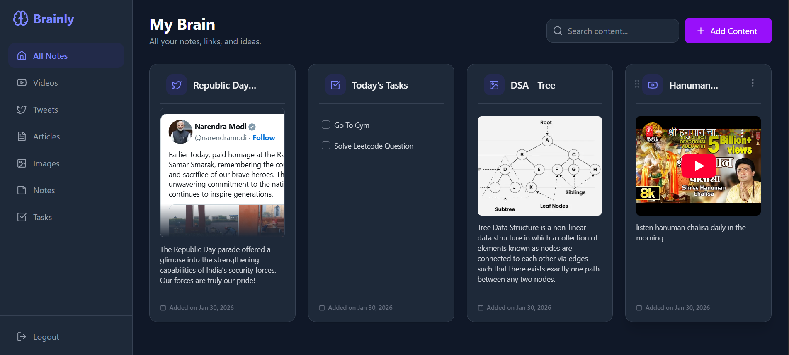

<h1 align="center">
  🧠 Brainly — Your Second Brain
</h1>

<p align="center">
  <b>Capture, organize, and share everything that matters — YouTube, articles, social posts, notes, tasks, and images — all in one beautiful workspace.</b>
</p>

<p align="center">
  
  
  
  
  
  
</p>

---



## ✨ Features

| Category | Feature |
|---|---|
| 📥 **Capture** | YouTube, Twitter/X, Instagram, LinkedIn, Spotify, Pinterest, articles, notes, tasks, images |
| 🔍 **Search** | 300ms debounced search · `Ctrl+K` shortcut · inline clear `×` button |
| 📌 **Organize** | Filter by type · pin items · drag-and-drop reorder |
| 🔗 **Share** | Public share links per card or for your whole collection |
| 📧 **Email** | Real transactional emails via Resend — branded OTP templates for signup & password reset |
| 🔐 **Auth** | Email + OTP signup · Google OAuth · forgot-password · JWT (7d expiry) |
| 🛡️ **Security** | Rate limiting (auth routes) · email limit (5/day per user) · bcrypt 10 rounds · CORS from env |
| 🐛 **Bug Reports** | In-app reporting · admin dashboard with Open / In Progress / Closed status |
| 🌙 **Theming** | Full dark/light mode with system preference detection |
| 📱 **Responsive** | Full-width mobile search · sidebar overlay · adaptive header · touch-friendly card menus |

---

## 🗂 Project Structure

```
Brainly/
├── backend/                   # Express + TypeScript API
│   └── src/
│       ├── routes/            # user, content, bugs, validateToken
│       ├── middleware/        # authMiddleware, upload
│       ├── services/
│       │   └── email.ts       # Resend integration — OTP HTML templates
│       ├── Db.ts              # Mongoose schemas
│       └── Index.ts           # Entry point (CORS, rate limiting, routes)
└── frontend/                  # React 19 + Vite + Tailwind 4
    └── src/
        ├── pages/             # SignIn, SignUp, ForgotPassword, Dashboard, AdminBugDashboard, NotFound
        ├── components/        # Card, SideBar, Modals, RouteGuards, ThemeToggle…
        ├── hooks/             # useContent
        └── Config.ts          # BACKEND_URL from env
```

---

## 🚀 Quick Start

### Prerequisites
- Node.js 18+
- MongoDB Atlas (or local)
- [Resend](https://resend.com) account with a verified sending domain

### 1. Clone & install

```bash
git clone https://github.com/your-username/brainly.git
cd brainly

cd backend && npm install
cd ../frontend && npm install
```

### 2. Configure environment

**`backend/src/.env`**
```env
PORT=3000
MONGO_URL=your_mongodb_connection_string
JWT_SECRET=a_long_random_secret_32_chars_min
GOOGLE_CLIENT_ID=your_google_client_id
GOOGLE_CLIENT_SECRET=your_google_client_secret
GOOGLE_CALLBACK_URL=http://localhost:3000/api/v1/user/auth/google/callback
ADMIN_EMAIL=admin@yourdomain.com
ADMIN_PASSWORD=strong_password
ALLOWED_ORIGIN=http://localhost:5173
RESEND_API_KEY=re_your_resend_api_key
FROM_EMAIL=Brainly <no-reply@yourdomain.com>
```

**`frontend/.env`**
```env
VITE_BACKEND_URL=http://localhost:3000
VITE_GOOGLE_CLIENT_ID=your_google_client_id
```

### 3. Run locally

```bash
# Terminal 1 — Backend (builds TS then watches with nodemon)
cd backend && npm run dev

# Terminal 2 — Frontend (Vite HMR)
cd frontend && npm run dev
```

Open [http://localhost:5173](http://localhost:5173)

---

## 🚢 Production / PM2

```bash
# Backend — build + start with plain node (no nodemon)
cd backend && npm run start
# or with PM2:
pm2 start "npm run start" --name brainly-api --cwd /path/to/backend

# Frontend — build static files, then serve via Nginx
cd frontend && npm run start   # outputs to frontend/dist/
```

**Update `.env` before deploying:**
- `ALLOWED_ORIGIN` → your production domain
- `VITE_BACKEND_URL` → your API URL
- `GOOGLE_CALLBACK_URL` → production callback URL
- Add production domain to Google OAuth "Authorized origins"
- Verify sending domain in Resend dashboard

---

## 🔑 Admin Access

The admin account is auto-created on first login using `ADMIN_EMAIL` / `ADMIN_PASSWORD` from `.env`.

- View all bug reports at `/admin/bugs`
- Update bug status: **Open → In Progress → Closed**
- Delete bug reports

---

## 🛡️ Security Highlights

| Layer | Detail |
|---|---|
| Auth rate limiting | 20 req / 15 min on all auth routes |
| Email rate limiting | Max 5 OTP emails / day per user (resets midnight) |
| bcrypt | 10 salt rounds |
| JWT | 7-day expiry |
| CORS | Controlled via `ALLOWED_ORIGIN` env variable |
| Route guards | `PrivateRoute` + `AdminRoute` on frontend |
| Signup loop fix | Unverified accounts get a fresh OTP instead of "email exists" error |

---

## 📧 Email Templates

Two branded HTML emails sent via Resend:

| Template | Trigger |
|---|---|
| **Welcome / Verify Account** | Signup, resend OTP |
| **Password Reset** | Forgot password |

Both feature the Brainly brain logo, indigo→violet gradient header, and a large digit-by-digit OTP box.

---

## 🌐 Supported Content Types

| | Type | Examples |
|---|---|---|
| 🎬 | YouTube | youtube.com, youtu.be |
| 🐦 | Twitter / X | twitter.com, x.com |
| 📸 | Instagram | instagram.com |
| 💼 | LinkedIn | linkedin.com |
| 🎵 | Spotify | open.spotify.com |
| 📌 | Pinterest | pinterest.com |
| 📰 | Article | Any URL (OG metadata fetched) |
| 📝 | Note | Plain text |
| ✅ | Task | Checklist with persistent state |
| 🖼️ | Image | Direct image URLs |

---

## 📦 Tech Stack

**Frontend** — React 19 · TypeScript · Vite · Tailwind CSS 4 · Framer Motion · @dnd-kit · Axios · React Hot Toast

**Backend** — Node.js · Express · TypeScript · MongoDB · Mongoose · Resend · bcrypt · jsonwebtoken · express-rate-limit · Google Auth Library

---

## 📄 License

MIT © 2026 Brainly
